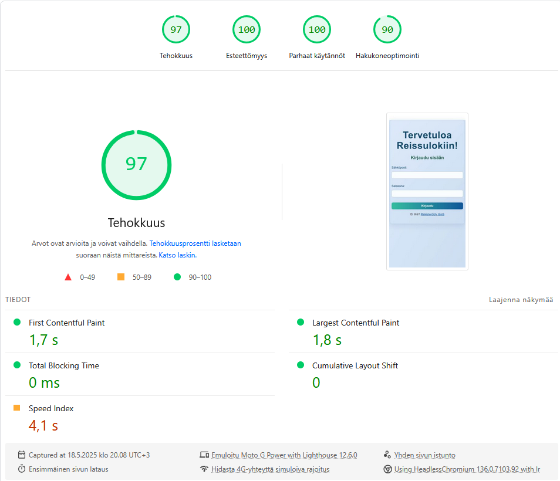
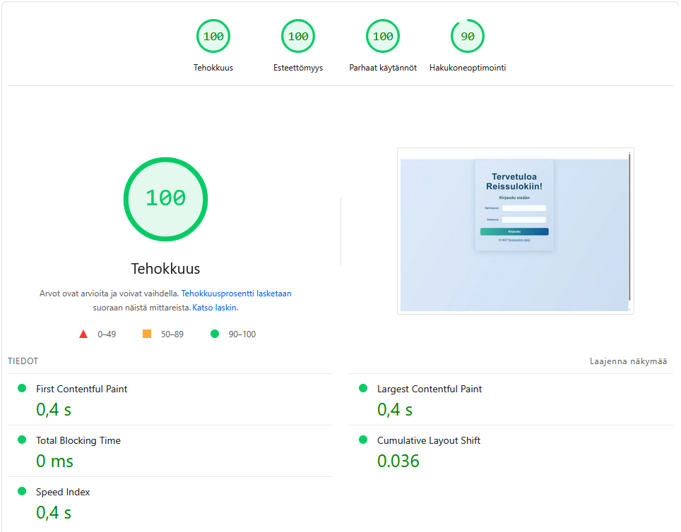

# Reissuloki – Harjoitustyön raportti

## 1. Johdanto
Tässä raportissa käydään läpi sivuston idea, sisältö, visuaalinen ilme ja käytettävyys, responsiivisuus sekä tekniset ratkaisut kuten autentikointiin, tietokantaan ja kolmannen osapuolen palveluihin liittyvät ominaisuudet. Lisäksi esitetään lyhyet testiraportit sivuston latautumisajoista ja selaintuen toimivuudesta.

## 2. Sivuston idea ja sisältö
Sivuston perusideana on tarjota käytännöllinen ja hyödyllinen tieto maailman maista. Käyttäjä voi kirjautua sisään, jolloin hän pääsee tarkastelemaan listaa maailman maista, joissa jokaisesta esitetään perustietoja. Käyttäjä voi merkitä maan kohdalla, onko hän käynyt kyseisessä maassa tai haluaisiko hän käydä siellä tulevaisuudessa. Lisäksi sivustolla on mahdollisuus jättää kommentteja, jotka tukevat tiedon jakamista ja käyttäjäkokemusten antamista.

## 3. Tekninen toteutus
- **Frontend:** React ja TypeScript mahdollistavat modulaarisen, dynaamisen ja skaalautuvan käyttöliittymän.
- **Autentikointi:** Käytössä on Firebase Authentication (FireAuth), jolla varmistetaan turvallinen tunnistautuminen.
- **Tietokanta:** Firestore toimii backend-puolen tietokantana, tarjoten reaaliaikaisen tietojenvaihdon ja skaalautuvuutta.
- **Kolmannen osapuolen palvelut:** REST API (restcountries.com) tarjoaa ajantasaiset tiedot maailman maista, mikä varmistaa sisällön ajantasaisuuden ja monipuolisuuden.

## 4. Käytettävyys, visuaalisuus ja selkeys
Sivuston ulkoasu ja navigointi on toteutettu selkeästi ja käyttäjäystävällisesti. Kaikki sivut noudattavat yhtenäistä rakennetta ja visuaalista ilmettä, mikä tukee helppoa liikkumista sisällön välillä. Sivusto on suunniteltu WCAG-ohjeistuksen mukaisesti, joten saavutettavuus on otettu huomioon kaikissa osa-alueissa. Tyylikäs ja selkeä visuaalinen toteutus varmistaa, että sisältö on helposti hahmotettavissa ja käytettävissä kaikille käyttäjille.

## 5. Responsiivisuus
Sivusto on suunniteltu toimimaan saumattomasti eri kokoisilla päätelaitteilla. Testaus on suoritettu seuraavilla laitteilla ja selaimilla:
- **Tietokone:** Mozilla Firefox, Google Chrome ja Microsoft Edge
- **Puhelin:** Google Chrome

Testitulokset osoittavat, että sivuston responsiivisuus toimii erinomaisesti: käyttöliittymä skaalautuu automaattisesti eri näyttökokoihin ja käyttöympäristöihin, mikä takaa yhtenäisen käyttäjäkokemuksen riippumatta käytetystä laitteesta.

## 6. Sivujen suorituskyky

**Mobiililaitteiden tulokset:**
- Tehokkuus: 97
- Esteettömyys: 100
- Parhaat käytännöt: 100
- First Contentful Paint (FCP): 1,7 s
- Largest Contentful Paint (LCP): 1,8 s
- Total Blocking Time (TBT): 0 ms
- Cumulative Layout Shift (CLS): 0.029
- Speed Index: 4,2 s

**Tietokoneen tulokset:**
- Tehokkuus: 100
- Esteettömyys: 100
- Parhaat käytännöt: 100
- First Contentful Paint (FCP): 0,4 s
- Largest Contentful Paint (LCP): 0,4 s
- Total Blocking Time (TBT): 0 ms
- Cumulative Layout Shift (CLS): 0.036
- Speed Index: 0,4 s

PageSpeed Insights -analyysin perusteella sivusto on erittäin suorituskykyinen sekä mobiililaitteilla että tietokoneella. Molemmilla saavutetaan huippuarvot tehokkuudessa, esteettömyydessä ja parhaissa käytännöissä.

Mobiililla tietyt latausmittarit, kuten First Contentful Paint ja Speed Index, ovat hieman hitaampia kuin tietokoneella, mikä voi johtua esimerkiksi laitteiston, verkkoyhteyden tai resurssien erojen vuoksi.

Kaikki mittarit ylittävät suositukset selvästi, ja sivusto tarjoaa erinomaisen käyttökokemuksen kaikilla päätelaitteilla.

## 7. Yhteenveto
Reissuloki on hyvin suunniteltu ja teknisesti vahva matkailusivusto, joka tarjoaa käyttäjille mahdollisuuden tutkia ja merkitä käymiään tai haluamiaan matkakohteita sekä jättää kommentteja. Sivuston navigointi on selkeää, saavutettavuus WCAG-standardien mukaista ja suorituskyky testitulosten perusteella erinomainen eri laitteilla ja selaimilla.

Kokonaisuudessaan Reissuloki on jo vahvalla pohjalla, mutta jatkokehitys käyttäjävuorovaikutuksen ja maiden tietosisällön laajentamisen suuntaan tekisi sivustosta entistä hyödyllisemmän ja kiinnostavamman matkailuyhteisölle.

## Reissuloki-sivuston esikatselu

  <iframe src="https://jinpulol.github.io/reissuloki/" width="100%" height="600" style="border:1px solid #ccc;"></iframe>

